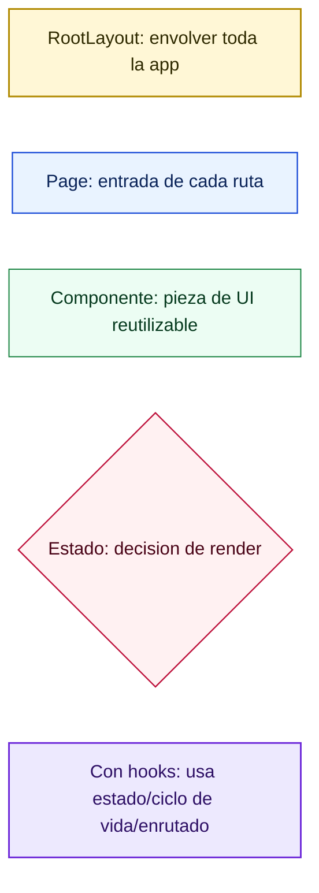
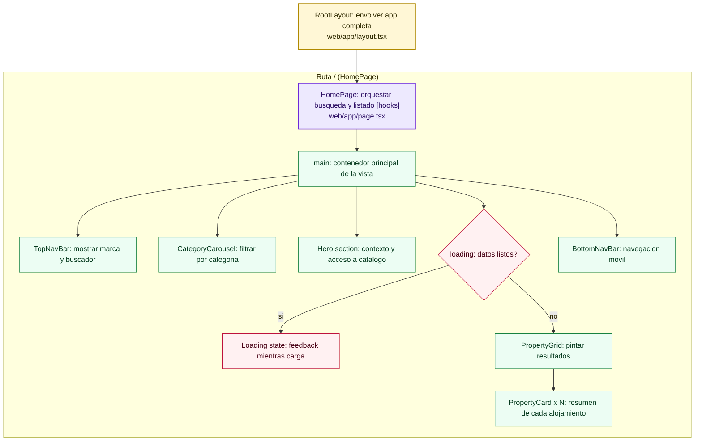
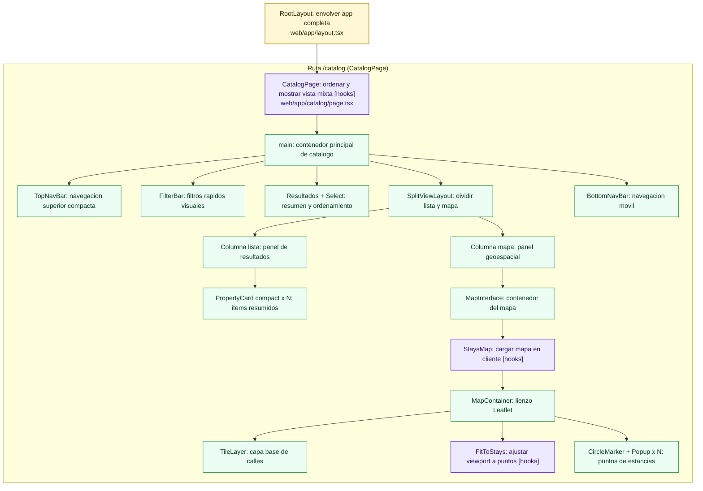
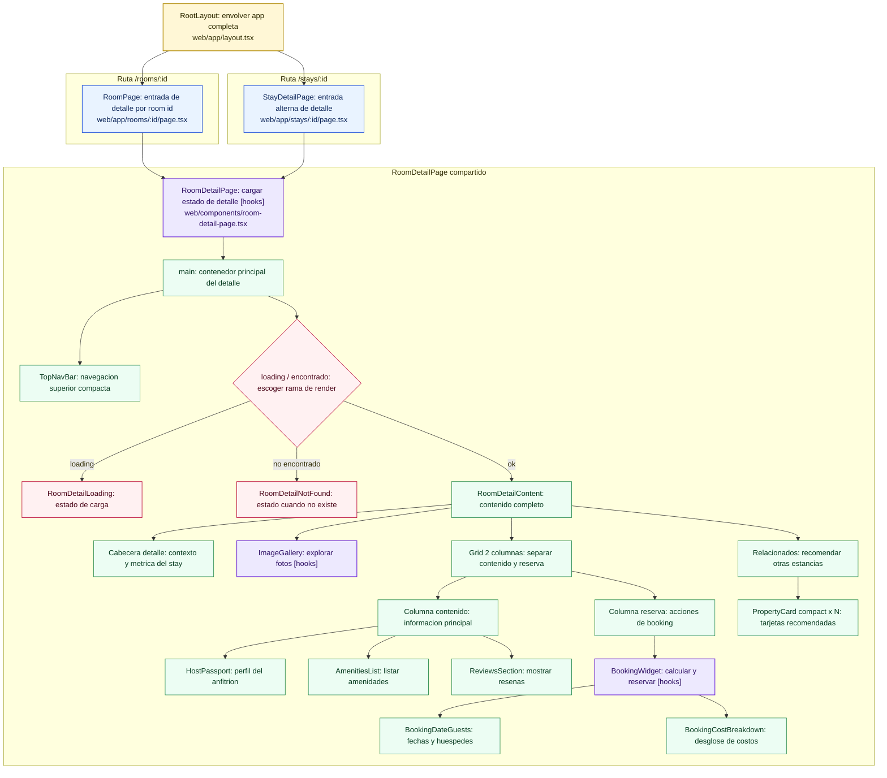

# Guía de arquitectura y layout

Este documento describe la estructura de páginas, layout y componentes principales del proyecto, explicando para qué sirve y cómo funciona cada elemento clave.

---

## Tabla de páginas y layout (visión rápida)

| Ruta | Archivo de entrada | Estructura principal | Componentes clave |
|---|---|---|---|
| / | web/app/page.tsx | main → header/top nav → categorías → hero → grid/estado vacío → bottom nav móvil | TopNavBar, CategoryCarousel, PropertyGrid, BottomNavBar |
| /catalog | web/app/catalog/page.tsx | main → top nav compacta → filter bar → barra de resultados/orden → split list+map → bottom nav | TopNavBar, FilterBar, SplitViewLayout, BottomNavBar |
| /rooms/[id] | web/app/rooms/[id]/page.tsx | wrapper mínimo que delega en detalle | RoomDetailPage |
| /stays/[id] | web/app/stays/[id]/page.tsx | wrapper mínimo que delega en detalle | RoomDetailPage |
| Layout global | web/app/layout.tsx | html(lang=es) → body flex column → children | RootLayout (fuentes, estilos globales, metadata) |

---

## Árbol de layout/composición (tipo DOM) por ruta

### Ruta /
- RootLayout
  - HomePage
    - main
      - TopNavBar (con buscador activo)
      - CategoryCarousel (botones por categoría)
      - section hero (título + link a catálogo)
      - estado condicional
        - si loading: bloque Cargando alojamientos
        - si no loading: PropertyGrid
          - lista de PropertyCard
            - cada PropertyCard: imagen, badges, título, rating, precio, link a detalle
      - BottomNavBar (móvil)

### Ruta /catalog
- RootLayout
  - CatalogPage
    - main
      - TopNavBar (compact)
      - FilterBar (pills de filtros)
      - section (contador resultados + select de orden)
      - SplitViewLayout
        - columna izquierda: lista de PropertyCard compact
        - columna derecha: MapInterface
          - StaysMap (Leaflet, marcadores, popups)
      - BottomNavBar (móvil)

### Ruta /rooms/[id] y /stays/[id]
- RootLayout
  - RoomDetailPage
    - main
      - TopNavBar (compact)
      - estado condicional
        - RoomDetailLoading
        - o RoomDetailNotFound
        - o RoomDetailContent
          - cabecera detalle (volver, título, rating, ubicación)
          - ImageGallery (imagen principal + miniaturas + navegación)
          - grid 2 columnas
            - columna contenido: descripción + HostPassport + AmenitiesList + ReviewsSection
            - columna lateral: BookingWidget
              - BookingDateGuests (DatePicker check-in/out + control huéspedes)
              - BookingCostBreakdown (subtotal, fees, total)
          - sección relacionados: lista de PropertyCard compact

---

## Matriz de componentes compartidos

| Componente | / | /catalog | /rooms/[id] | /stays/[id] |
|---|---:|---:|---:|---:|
| TopNavBar | Sí | Sí | Sí | Sí |
| BottomNavBar | Sí | Sí | No | No |
| PropertyCard | Sí | Sí | Sí | Sí |
| RoomDetailPage | No | No | Sí | Sí |
| MapInterface / StaysMap | No | Sí | No | No |
| BookingWidget | No | No | Sí | Sí |

---

## Mapa de hooks (donde se usan)

| Archivo | Hooks usados | Para qué se usan |
|---|---|---|
| web/app/page.tsx | useState, useEffect | Estado de búsqueda/filtros/carga y simulación de carga inicial de datos |
| web/app/catalog/page.tsx | useState, useMemo | Estado de orden y memoización de lista ordenada |
| web/components/room-detail-page.tsx | useState, useEffect, useMemo, useParams | Leer id de ruta, cargar estancia, calcular relacionados y manejar estados |
| web/components/image-gallery.tsx | useState, useMemo | Índice actual de galería y fallback de imágenes |
| web/components/booking-widget.tsx | useState, useMemo | Estado de fechas/huéspedes y cálculo de noches/costos |
| web/components/stays-map.tsx | useEffect, useMemo | Ajuste de viewport y cálculo del centro inicial del mapa |

---

## Para qué sirve y cómo funciona cada elemento

| Elemento | Dónde está | Para qué sirve | Cómo lo hace (general) |
|---|---|---|---|
| RootLayout | web/app/layout.tsx | Define la estructura base de toda la app | Envuelve todas las páginas en html/body, carga estilos globales y fuentes, y renderiza children |
| HomePage | web/app/page.tsx | Página principal de exploración | Maneja estado de búsqueda/categoría/carga y decide qué lista mostrar |
| TopNavBar | web/components/top-nav-bar.tsx | Navegación superior y búsqueda | Renderiza header sticky; si recibe searchValue + onSearchChange muestra input controlado, si no muestra CTA de búsqueda simple |
| CategoryCarousel | web/components/category-carousel.tsx | Filtrar por categorías visuales | Recorre categorías y pinta botones (modo interactivo) o links (modo navegación), marcando activo |
| PropertyGrid | web/components/property-grid.tsx | Mostrar resultados en rejilla | Mapea stays y crea una PropertyCard por cada alojamiento |
| PropertyCard | web/components/property-card.tsx | Tarjeta resumida de un alojamiento | Muestra imagen, badges, rating, precio; enlaza al detalle con Link dinámico a /rooms/[id] |
| BottomNavBar | web/components/bottom-nav-bar.tsx | Navegación inferior móvil | Lista items fijos y resalta el activo según prop active |
| CatalogPage | web/app/catalog/page.tsx | Vista catálogo con lista + mapa | Ordena resultados por precio y los pasa a un layout dividido |
| FilterBar | web/components/filter-bar.tsx | Filtros rápidos de catálogo | Renderiza pills de filtro y etiqueta de categoría activa |
| SplitViewLayout | web/components/split-view-layout.tsx | Composición 2 columnas catálogo | Izquierda: cards compactas; derecha: mapa interactivo |
| MapInterface | web/components/map-interface.tsx | Contenedor visual del mapa | Carga StaysMap de forma dinámica (sin SSR) y muestra fallback de carga |
| StaysMap | web/components/stays-map.tsx | Mostrar alojamientos geolocalizados | Usa react-leaflet: centra mapa, ajusta bounds según puntos y dibuja marcadores con popup |
| RoomPage / StayDetailPage | web/app/rooms/[id]/page.tsx, web/app/stays/[id]/page.tsx | Entradas de rutas de detalle | Delegan todo el render a RoomDetailPage |
| RoomDetailPage | web/components/room-detail-page.tsx | Orquestar el detalle de una estancia | Toma id desde URL, busca datos, maneja loading/not found y renderiza contenido final |
| RoomDetailLoading | web/components/room-detail-status.tsx | Estado de carga del detalle | Muestra bloque de feedback mientras se resuelven datos |
| RoomDetailNotFound | web/components/room-detail-status.tsx | Estado cuando no existe la estancia | Muestra mensaje y link de retorno al catálogo |
| RoomDetailContent | web/components/room-detail-content.tsx | Cuerpo completo del detalle | Compone secciones: galería, info, anfitrión, amenities, reseñas, reserva y recomendados |
| ImageGallery | web/components/image-gallery.tsx | Galería principal del detalle | Mantiene índice activo, permite anterior/siguiente y selección por miniaturas |
| HostPassport | web/components/host-passport.tsx | Presentar datos del anfitrión | Muestra perfil básico y badge de superhost condicional |
| AmenitiesList | web/components/amenities-list.tsx | Listar amenidades del alojamiento | Recorre amenities y asigna icono simple por palabras clave |
| ReviewsSection | web/components/reviews-section.tsx | Mostrar reseñas de huéspedes | Mapea reviews en cards y deja input de búsqueda como UI de apoyo |
| BookingWidget | web/components/booking-widget.tsx | Simular reserva y costos | Controla fechas/huéspedes y calcula noches, subtotal, fees y total |
| BookingDateGuests | web/components/booking-date-guests.tsx | Selección de fechas y huéspedes | Usa DatePicker para check-in/check-out y stepper para número de personas |
| BookingCostBreakdown | web/components/booking-cost-breakdown.tsx | Desglosar costos de reserva | Recibe valores ya calculados y los presenta en formato resumen |
| Datos y helpers | web/lib/stays-data.ts | Fuente de datos y utilidades | Exporta stays/categorías y funciones getStayById/getRelatedStays para consultas |

---

**Cómo usar este documento**
- Empieza por la tabla de rutas para orientarte.
- Usa los árboles para entender la composición real de cada página.
- Consulta la matriz para ver reutilización y dependencias.
- Lee la tabla de "para qué sirve" para entender el propósito y funcionamiento general de cada pieza.

Este documento es útil para onboarding, debugging, refactor y comunicación con equipo técnico y no técnico.

---

## Diagrama Mermaid completo (árbol por página)

### Leyenda de colores

### 1) Home (/)

### 2) Catalog (/catalog)

### 3) Detail (/rooms/:id y /stays/:id)

### Cómo leer estos diagramas
- Cada nodo representa un componente o bloque estructural real del render.
- Las flechas indican composición (quién renderiza a quién).
- Los rombos representan condiciones (por ejemplo loading o not found).
- Los nodos con x N indican listas renderizadas con map.
- Los nodos en color violeta y con etiqueta [hooks] usan hooks de React o de enrutado.
